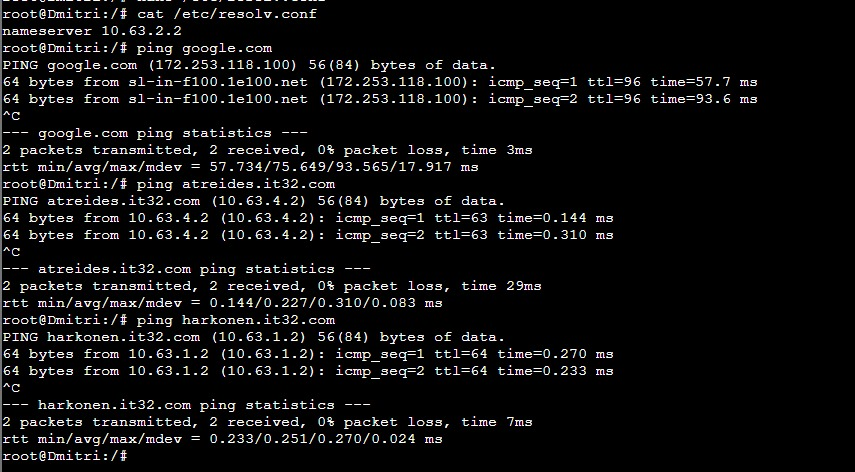
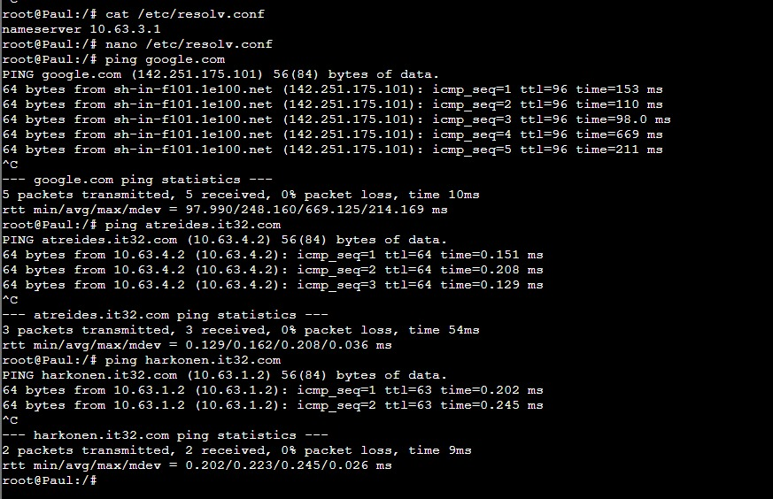
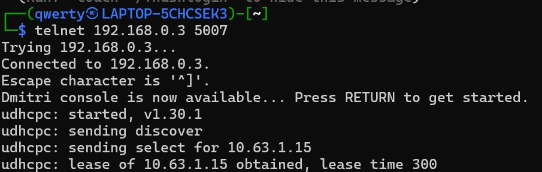
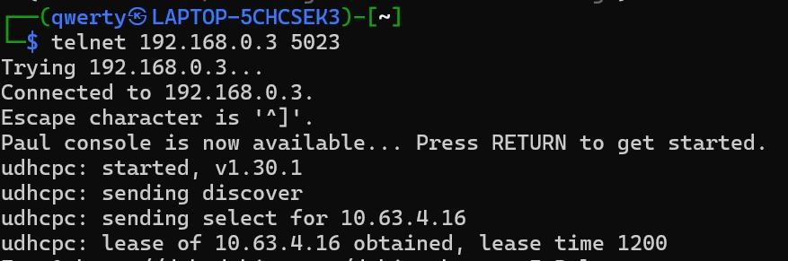
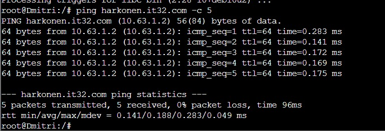
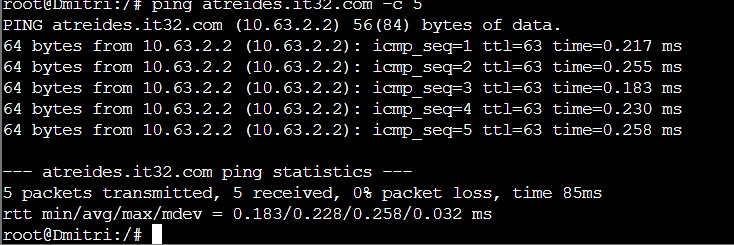
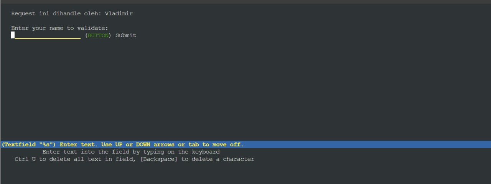

# Laporan Resmi Praktikum Jarkom Modul 3
## Kelompok IT32
**Anggota Kelompok:**

| Nama                               | NRP        |
| ---------------------------------- | ---------- |
| Atha Rahma Arianti                 | 5027221030 |
| Nur Azka Rahadiansyah              | 5027221064 |


| Node    | Kategori            | Konfigurasi IP |
| ------- | ------------------- | -------------- |
| Arakis  | Router (DHCP Relay) | Dynamic        |
| Mohiam  | DHCP Server         | Static         |
| Irulan  | DNS Server          | Static         |
| Chani   | Database Server     | Static         |
| Stilgar | Load Balancer       | Static         |
| Leto    | Laravel Worker      | Static         |
| Duncan  | Laravel Worker      | Static         |
| Jessica | Laravel Worker      | Static         |
| Vladimir| PHP Worker          | Static         |
| Rabban  | PHP Worker          | Static         |
| Feyd    | PHP Worker          | Static         |
| Dmitri  | Client              | Dynamic        |
| Paul    | Client              | Dynamic        |

## NETWORK CONFIG

- Arakis Router (DHCP Relay) Dynamic

  ```
  auto eth0
  iface eth0 inet dhcp
  up iptables -t nat -A POSTROUTING -o eth0 -j MASQUERADE -s 10.63.0.0/16
  
  auto eth1
  iface eth1 inet static
  	address 10.63.1.0
  	netmask 255.255.255.0
  
  auto eth2
  iface eth2 inet static
  	address 10.63.2.0
  	netmask 255.255.255.0
  
  auto eth3
  iface eth3 inet static
  	address 10.63.3.0
  	netmask 255.255.255.0
  
  auto eth4
  iface eth4 inet static
  	address 10.63.4.0
  	netmask 255.255.255.0
  ```

- Harkomen:

  Dmitri (Client - Dynamic)

  ```
  auto eth0
  iface eth0 inet dhcp
  ```
  
  Vladimir (PHP Worker)

  ```
  auto eth0
  iface eth0 inet static
  	address 10.63.1.2
  	netmask 255.255.255.0
  	gateway 10.63.1.0
  ```
  
  Rabban (PHP Worker)

  ```
  auto eth0
  iface eth0 inet static
  	address 10.63.1.3
  	netmask 255.255.255.0
  	gateway 10.63.1.0
  ```

  Feyd (PHP Worker)

  ```
  auto eth0
  iface eth0 inet static
  	address 10.63.1.4
  	netmask 255.255.255.0
  	gateway 10.63.1.0
  ```

- Corrino:
  
  Irulan (DNS Server)
  
  ```
  auto eth0
  iface eth0 inet static
  	address 10.63.3.2
  	netmask 255.255.255.0
  	gateway 10.63.3.0
  ```
  
  Mohiam (DHCP Server)

  ```
  auto eth0
  iface eth0 inet static
  	address 10.63.3.3
  	netmask 255.255.255.0
  	gateway 10.63.3.0
  ```


- Atreides:
  
  Paul (Client - Dynamic)
  ```
  auto eth0
  iface eth0 inet dhcp
  ```
  
  Leto (Laravel Worker)

  ```
  auto eth0
  iface eth0 inet static
  	address 10.63.2.2
  	netmask 255.255.255.0
  	gateway 10.63.2.0
  ```
  
  Duncan (Laravel Worker)

  ```
  auto eth0
  iface eth0 inet static
  	address 10.63.2.3
  	netmask 255.255.255.0
  	gateway 10.63.2.0
  ```
  
  Jessica (Laravel Worker)

  ```
  auto eth0
  iface eth0 inet static
  	address 10.63.2.4
  	netmask 255.255.255.0
  	gateway 10.63.2.0
  ```

- Fremen:
  
  Stilgar (Load Balancer)
  
  ```
  auto eth0
  iface eth0 inet static
  	address 10.63.4.2
  	netmask 255.255.255.0
  	gateway 10.63.4.0
  ```

  Chani (Database Server)
  
  ```
  auto eth0
  iface eth0 inet static
  	address 10.63.4.3
  	netmask 255.255.255.0
  	gateway 10.63.4.0
  ```


## SETUP DI BASHRC

- Irulan (DNS Server):

  ```
  echo 'nameserver 192.168.122.1' > /etc/resolv.conf
  apt-get update
  apt-get install bind9 -y  

  echo ‘
  options {
      directory "/var/cache/bind";
  
      forwarders {
          192.168.122.1;
      };
  
      // dnssec-validation auto;
      allow-query { any; };
      auth-nxdomain no;    # conform to RFC1035
      listen-on-v6 { any; };
  };
  ‘ > /etc/bind/named.conf.options
  
  service bind9 restart

  ```

- Mohiam DHCP Server:

  ```
  echo 'nameserver 10.63.3.2' > /etc/resolv.conf  
  apt-get update
  apt install isc-dhcp-server -y
  dhcpd --version

  echo INTERFACES="eth0" > /etc/default/isc-dhcp-serverm
  ```

- Arakis DHCP Relay:

  ```
  apt-get update
  apt install isc-dhcp-relay -y
  ```

  isi IP mohiam: 10.63.3.3

- Chani Database server:

  ```
  echo 'nameserver 10.63.3.2' > /etc/resolv.conf
  apt-get update
  apt-get install mariadb-server -y
  
  service mysql start
  ```
  
  Lalu jangan lupa untuk mengganti [bind-address] pada file /etc/mysql/mariadb.conf.d/50-server.cnf menjadi 0.0.0.0
  
  ```
  service mysql restart
  ```

- Stilgar Load Balancer:

  ```
  echo 'nameserver 10.63.3.2' > /etc/resolv.conf
  apt-get update
  apt-get install apache2-utils -y
  apt-get install nginx -y
  apt-get install lynx -y
  
  service nginx start
  ```

- Vladimir, Rabban, Feyd PHP worker:

  ```
  echo 'nameserver 10.63.3.2' > /etc/resolv.conf
  apt-get update
  apt-get install nginx -y
  apt-get install wget -y
  apt-get install unzip -y
  apt-get install lynx -y
  apt-get install htop -y
  apt-get install apache2-utils -y
  apt-get install php7.3-fpm php7.3-common php7.3-mysql php7.3-gmp php7.3-curl php7.3-intl php7.3-mbstring php7.3-xmlrpc php7.3-gd php7.3-xml php7.3-cli php7.3-zip -y
  
  service nginx start
  service php7.3-fpm start
  ```

- Leto, Duncan, Jessica laravel worker:

  ```
  echo 'nameserver 10.63.3.2' > /etc/resolv.conf
  apt-get update
  apt-get install mariadb-client -y
  apt-get install lynx -y
  apt-get install -y lsb-release ca-certificates apt-transport-https software-properties-common gnupg2
  curl -sSLo /usr/share/keyrings/deb.sury.org-php.gpg https://packages.sury.org/php/apt.gpg
  sh -c 'echo "deb [signed-by=/usr/share/keyrings/deb.sury.org-php.gpg] https://packages.sury.org/php/ $(lsb_release -sc) main" > /etc/apt/sources.li$apt-get update
  apt-get install php8.0-mbstring php8.0-xml php8.0-cli php8.0-common php8.0-intl php8.0-opcache php8.0-readline php8.0-mysql php8.0-fpm php8.0-curl $apt-get install nginx -y
  wget https://getcomposer.org/download/2.0.13/composer.phar
  chmod +x composer.phar
  mv composer.phar /usr/bin/composer
  apt-get install git -y
  git clone https://github.com/martuafernando/laravel-praktikum-jarkom /var/www/laravel-praktikum-jarkom
  composer update
  composer install
  ```

- Dmitri, Paul client:

  ```
  apt update
  apt install lynx -y
  apt install htop -y
  apt install apache2-utils -y
  apt-get install jq -y
  ```

## PENGERJAAN

0. meregister domain name atreides.yyy.com untuk worker Laravel mengarah pada Leto Atreides . dan mendaftarkan domain name harkonen.yyy.com untuk worker PHP mengarah pada Vladimir Harkonen

  Kode di dalam DNS Server (Irulan)

  ```
  #JANGAN LUPA GANTI RESOLV.CONF CLIENT (DMITRI/PAUL) KE IP IRULAN (10.65.3.2)
  
  
  echo 'zone "atreides.it32.com" {
          type master;
          file "/etc/bind/jarkom/atreides.it32.com";
  };
  
  
  zone "harkonen.it32.com" {
          type master;
          file "/etc/bind/jarkom/harkonen.it32.com";
  };' > /etc/bind/named.conf.local
  
  
  mkdir /etc/bind/jarkom
  
  
  echo ';
  ; BIND data file for local loopback interface
  ;
  $TTL    604800
  @       IN      SOA     atreides.it32.com. root.atreides.it32.com. (
                          2024051601      ; Serial
                          604800          ; Refresh
                          86400           ; Retry
                          2419200         ; Expire
                          604800 )        ; Negative Cache TTL
  ;
  @               IN      NS      atreides.it32.com.
  @               IN      A       10.63.2.2 ; IP Leto Laravel Workerr' > /etc/bind/jarkom/atreides.it32.com
  
  
  echo ';
  ; BIND data file for local loopback interface
  ;
  $TTL    604800
  @       IN      SOA     harkonen.it32.com.  harkonen.it32.com.  (
                          2024051601      ; Serial
                          604800          ; Refresh
                          86400           ; Retry
                          2419200         ; Expire
                          604800 )        ; Negative Cache TTL
  ;
  @               IN      NS      harkonen.it32.com.
  @               IN      A       10.63.1.2 ; IP Vladimir PHP Worker' > /etc/bind/jarkom/harkonen.it32.com
  
  
  echo 'options {
          directory "/var/cache/bind";
  
  
          forwarders {
                  192.168.122.1;
          };
  
  
          // dnssec-validation auto;
          allow-query{any;};
          auth-nxdomain no;    # conform to RFC1035
          listen-on-v6 { any; };
  }; ' >/etc/bind/named.conf.options
  
  
  service bind9 restart
  ```
2. Client yang melalui House Harkonen mendapatkan range IP dari [prefix IP].1.14 - [prefix IP].1.28 dan [prefix IP].1.49 - [prefix IP].1.70

  ```
  echo 'subnet 10.63.1.0 netmask 255.255.255.0 {
  }
  
  
  subnet 10.63.2.0 netmask 255.255.255.0 {
  }
  
  
  subnet 10.63.1.0 netmask 255.255.255.0 {
      range 10.63.1.14 10.63.1.28;
      range 10.63.1.49 10.63.1.70;
      option routers 10.63.1.0;
  
  
  }' > /etc/dhcp/dhcpd.conf

  ```

3.  Client yang melalui House Atreides mendapatkan range IP dari [prefix IP].2.15 - [prefix IP].2.25 dan [prefix IP].2 .200 - [prefix IP].2.210

  ```
  echo 'subnet 10.63.1.0 netmask 255.255.255.0 {
  }
  
  
  subnet 10.63.2.0 netmask 255.255.255.0 {
  }
  
  
  subnet 10.63.1.0 netmask 255.255.255.0 {
      range 10.63.1.14 10.63.1.28;
      range 10.63.1.49 10.63.1.70;
      option routers 10.63.1.0;
  
  
  subnet 10.63.2.0 netmask 255.255.255.0 {
      range 10.63.2.15 10.63.2.25;
      range 10.63.2.200 10.63.2.210;
      option routers 10.63.2.0;
  
  
  
  
  }' > /etc/dhcp/dhcpd.conf

  ```

4.  Client mendapatkan DNS dari Princess Irulan dan dapat terhubung dengan internet melalui DNS tersebut

  ```
  echo 'subnet 10.63.1.0 netmask 255.255.255.0 {
  }
  subnet 10.63.2.0 netmask 255.255.255.0 {
  }
  subnet 10.63.1.0 netmask 255.255.255.0 {
      range 10.63.1.14 10.63.1.28;
      range 10.63.1.49 10.63.1.70;
      option routers 10.63.1.0;
      option broadcast-address 10.63.1.255;
      option domain-name-servers 10.63.3.2;
  
  
  
  
  subnet 10.63.2.0 netmask 255.255.255.0 {
      range 10.63.2.15 10.63.2.25;
      range 10.63.2.200 10.63.2.210;
      option routers 10.63.2.0;
      option broadcast-address 10.63.2.255;
      option domain-name-servers 10.63.3.2;
  
  
  
  
  }' > /etc/dhcp/dhcpd.conf

  ```
Script 2-4 digabung menjadi:

```
subnet="option domain-name \"example.org\";
option domain-name-servers ns1.example.org, ns2.example.org;


ddns-update-style-none;


subnet 10.63.1.0 netmask 255.255.255.0 {
    range 10.63.1.14 10.63.1.28;
    range 10.63.1.49 10.63.1.70;
    option routers 10.63.1.0;
    option broadcast-address 10.63.1.255;
    option domain-name-servers 10.63.3.2;
}


subnet 10.63.2.0 netmask 255.255.255.0 {
    range 10.63.2.15 10.63.2.25;
    range 10.63.2.200 10.63.2.210;
    option routers 10.63.2.0;
    option broadcast-address 10.63.2.255;
    option domain-name-servers 10.63.3.2;


subnet 10.63.3.0 netmask 255.255.255.0 {
}


subnet 10.63.4.0 netmask 255.255.255.0 {
}
"
echo "$subnet" > /etc/dhcp/dhcpd.conf
service isc-dhcp-server restart

```

Tambahkan konfigurasi pada DHCP Relay (arakis), forward req ke dhcp rever mohiam `10.63.3.3`: 

```
echo '# Defaults for isc-dhcp-relay initscript
# sourced by /etc/init.d/isc-dhcp-relay
# installed at /etc/default/isc-dhcp-relay by the maintainer scripts


#
# This is a POSIX shell fragment
#


# What servers should the DHCP relay forward requests to?
SERVERS="10.63.3.3"


# On what interfaces should the DHCP relay (dhrelay) serve DHCP requests?
INTERFACES="eth1 eth2 eth3 eth4"


# Additional options that are passed to the DHCP relay daemon?
OPTIONS=""' > /etc/default/isc-dhcp-relay


service isc-dhcp-relay start 

```

Lalu pada file `/etc/sysctl.conf` lakukan uncommented pada `net.ipv4.ip_forward=1`

Hasil nomor 1-4:





5.  Durasi DHCP server meminjamkan alamat IP kepada Client yang melalui House Harkonen selama 5 menit sedangkan pada client yang melalui House Atreides selama 20 menit. Dengan waktu maksimal dialokasikan untuk peminjaman alamat IP selama 87 menit

  Mohiam:

  ```
  interfaces="INTERFACESv4=\"eth0\"
  INTERFACESv6=\"\"
  "
  echo "$interfaces" > /etc/default/isc-dhcp-server
  
  
  subnet="option domain-name \"example.org\";
  option domain-name-servers ns1.example.org, ns2.example.org;
  
  
  default-lease-time 600;
  max-lease-time 7200;
  
  
  ddns-update-style-none;
  
  
  subnet 10.63.1.0 netmask 255.255.255.0 {
      range 10.63.1.14 10.63.1.28;
      range 10.63.1.49 10.63.1.70;
      option routers 10.63.1.0;
      option broadcast-address 10.63.1.255;
      option domain-name-servers 10.63.3.2;
      default-lease-time 300;
      max-lease-time 5220;
  }
  
  
  subnet 10.63.2.0 netmask 255.255.255.0 {
      range 10.63.2.15 10.63.2.25;
      range 10.63.2.200 10.63.2.210;
      option routers 10.63.2.0;
      option broadcast-address 10.63.2.255;
      option domain-name-servers 10.63.3.2;
      default-lease-time 1200;
      max-lease-time 5220;
  }
  
  
  subnet 10.63.3.0 netmask 255.255.255.0 {
  }
  
  
  subnet 10.63.4.0 netmask 255.255.255.0 {
  }
  "
  echo "$subnet" > /etc/dhcp/dhcpd.conf
  
  
  service isc-dhcp-server restart

  ```

Hasil nomor 5:








6.  Vladimir Harkonen memerintahkan setiap worker(harkonen) PHP, untuk melakukan konfigurasi virtual host untuk website berikut dengan menggunakan php 7.3

  Masukkan setup kepada semua PHP Worker yang ada di Harkonen:

  ```
  wget -O '/var/www/harkonen.it32.com' 'https://drive.google.com/file/d/1lmnXJUbyx1JDt2OA5z_1dEowxozfkn30/view?usp=sharing'
  unzip -o /var/www/harkonen.it32.com -d /var/www/
  rm /var/www/harkonen.it32.com
  mv /var/www/modul-3 /var/www/harkonen.it32.com
  ```

  Script pengerjaan:

  ```
  cp /etc/nginx/sites-available/default /etc/nginx/sites-available/harkonen.it32.com
  ln -s /etc/nginx/sites-available/harkonen.it32.com /etc/nginx/sites-enabled/
  rm /etc/nginx/sites-enabled/default
  
  
  echo 'server {
      listen 80;
      server_name _;
  
  
      root /var/www/harkonen.it32.com;
      index index.php index.html index.htm;
  
  
      location / {
          try_files $uri $uri/ /index.php?$query_string;
      }
  
  
      location ~ \.php$ {
          include snippets/fastcgi-php.conf;
          fastcgi_pass unix:/run/php/php7.3-fpm.sock;  # Sesuaikan versi PHP dan socket
          fastcgi_param SCRIPT_FILENAME $document_root$fastcgi_script_name;
          include fastcgi_params;
      }
  }' > /etc/nginx/sites-available/granz.channel.it32.com
  
  
  service nginx restart
  ```

Hasil nomor 6:





7.  Aturlah agar Stilgar dari fremen dapat dapat bekerja sama dengan maksimal, lalu lakukan testing dengan 5000 request dan 150 request/second

8.  Karena diminta untuk menuliskan peta tercepat menuju spice, buatlah analisis hasil testing dengan 500 request dan 50 request/second masing-masing algoritma Load Balancer dengan ketentuan sebagai berikut:
Nama Algoritma Load Balancer
Report hasil testing pada Apache Benchmark
Grafik request per second untuk masing masing algoritma. 
Analisis

9. Dengan menggunakan algoritma Least-Connection, lakukan testing dengan menggunakan 3 worker, 2 worker, dan 1 worker sebanyak 1000 request dengan 10 request/second, kemudian tambahkan grafiknya pada peta.

10. Selanjutnya coba tambahkan keamanan dengan konfigurasi autentikasi di LB dengan dengan kombinasi username: “secmart” dan password: “kcksyyy”, dengan yyy merupakan kode kelompok. Terakhir simpan file “htpasswd” nya di /etc/nginx/supersecret/

  ```
  mkdir /etc/nginx/rahasiakita
  htpasswd -c /etc/nginx/supersecret/htpasswd secmart
  ```

  Lalu, masukkan passwordnya `kcksit32`. Jika sudah memasukkan password dan re-type password. Sekarang bisa dicoba dengan menambahkan command berikut pada setup nginx:

  ```
  auth_basic "Restricted Content";
  auth_basic_user_file /etc/nginx/rahasisakita/htpasswd;

  ```

11. Lalu buat untuk setiap request yang mengandung /dune akan di proxy passing menuju halaman https://www.dunemovie.com.au/. (11) hint: (proxy_pass)

  Config sebelum mengerjakan

  ```
  location ~ /dunemovie {
      proxy_pass https://www.dunemovie.com.au/;
      proxy_set_header Host www.dunemovie.com.au;
      proxy_set_header X-Real-IP $remote_addr;
      proxy_set_header X-Forwarded-For $proxy_add_x_forwarded_for;
  Script.sh : 
  
  
  echo 'upstream worker {
      server 10.63.3.1;
      server 10.63.3.2;
      server 10.63.3.3;
  }
  
  
  server {
      listen 80;
      server_name granz.channel.it32.com www.granz.channel.it32.com;
  
  
      root /var/www/html;
      index index.html index.htm index.nginx-debian.html;
  
  
      location / {
          proxy_pass http://worker;
      }
  
  
      location ~ /dunemovie {
      proxy_pass https://www.dunemovie.com.au/;
      proxy_set_header Host www.dunemovie.com.au;
      proxy_set_header X-Real-IP $remote_addr;
      proxy_set_header X-Forwarded-For $proxy_add_x_forwarded_for;
      proxy_set_header X-Forwarded-Proto $scheme;
      }
  }' > /etc/nginx/sites-available/lb_php

  ```

12. Selanjutnya LB ini hanya boleh diakses oleh client dengan IP [Prefix IP].1.37, [Prefix IP].1.67, [Prefix IP].2.203, dan [Prefix IP].2.207. (12) hint: (fixed in dulu clientnya)

  ```
   location / {
         allow 10.63.1.37;
    allow 10.63.1.67;
    allow 10.63.2.203;
    allow 10.63.2.207;
        deny all;
        proxy_pass http://worker;
    }

  ```

  Script.sh:

  ```
     location / {
   allow 10.63.1.37;
      allow 10.63.1.67;
      allow 10.63.2.203;
      allow 10.63.2.207;
      deny all;
      proxy_pass http://worker;
  }
  
  
  echo 'upstream worker {
      server 10.63.3.1;
      server 10.63.3.2;
      server 10.63.3.3;
  }
  
  
  server {
      listen 80;
      server_name granz.channel.it32.com www.granz.channel.it32.com;
  
  
      root /var/www/html;
      index index.html index.htm index.nginx-debian.html;
  
  
      location / {
           allow 10.63.1.37;
      allow 10.63.1.67;
      allow 10.63.2.203;
      allow 10.63.2.207;
          deny all;
          proxy_pass http://worker;
      }
  
  
          location ~ /dunemovie {
      proxy_pass https://www.dunemovie.com.au/;
      proxy_set_header Host www.dunemovie.com.au;
      proxy_set_header X-Real-IP $remote_addr;
      proxy_set_header X-Forwarded-For $proxy_add_x_forwarded_for;
      proxy_set_header X-Forwarded-Proto $scheme;
      }
  }' > /etc/nginx/sites-available/lb_php
  ```

13. Semua data yang diperlukan, diatur pada Chani dan harus dapat diakses oleh Leto, Duncan, dan Jessica

  Chani:

  ```
  # Db akan diakses oleh 3 worker, maka
  echo '# This group is read both by the client and the server
  # use it for options that affect everything
  [client-server]
  
  
  # Import all .cnf files from configuration directory
  !includedir /etc/mysql/conf.d/
  !includedir /etc/mysql/mariadb.conf.d/
  
  
  # Options affecting the MySQL server (mysqld)
  [mysqld]
  skip-networking=0
  skip-bind-address
  ' > /etc/mysql/my.cnf
  ```

  Lalu jangan lupa untuk mengubah `[bind-address]` pada file `/etc/mysql/mariadb.conf.d/50-server.cnf` menjadi `0.0.0.0`

  ```
  service mysql restart
  ```

  Kemudian jalankan perintah berikut:

  ```
  mysql -u root -p
  Enter password:
  
  
  
  
  CREATE USER 'kelompokit32'@'%' IDENTIFIED BY 'passwordit32';
  CREATE USER 'kelompokit32'@'localhost' IDENTIFIED BY 'passwordit32';
  CREATE DATABASE dbkelompokit32;
  GRANT ALL PRIVILEGES ON *.* TO 'kelompokit32'@'%';
  GRANT ALL PRIVILEGES ON *.* TO 'kelompokit32'@'localhost';
  FLUSH PRIVILEGES;
  ```

14. Leto, Duncan, dan Jessica memiliki atreides Channel sesuai dengan quest guide berikut. Jangan lupa melakukan instalasi PHP8.0 dan Composer

15. atreides Channel memiliki beberapa endpoint yang harus ditesting sebanyak 100 request dengan 10 request/second. Tambahkan response dan hasil testing pada grimoire.
POST /auth/register

  ```
  echo '
  {
    "username": "kelompokit32",
    "password": "passwordit32",
  }' > register.json
  ```

  ```
  ab -n 100 -c 10 -p register.json -T application/json http://10.63..:8001/api/auth/register
  ```

16. POST /auth/login

  ```
  echo '
  {
    "username": "kelompokit32",
    "password": "passwordit32",
  }' > login.json ab -n 100 -c 10 -p login.json -T application/json http://10.63..:8001/api/auth/login
  ```

17. GET /me

  Dapatkan tokennya terlebih dahulu sebelum mengakses endpoint /api/me

  ```
  curl -X POST -H "Content-Type: application/json" -d @login.json http://10.63..:8001/api/auth/login > login_output.txt
  ```

  Lalu jalankan perintah berikut untuk melakukan set token secara global

  ```
  token=$(cat login_output.txt | jq -r '.token')
  ```

  Setelah itu jalankan perintah berikut untuk melakukan testing

  ```
  ab -n 100 -c 10 -H "Authorization: Bearer $token" http://10.63..:8001/api/me
  ```

  

18. Untuk memastikan ketiganya bekerja sama secara adil untuk mengatur atreides Channel maka implementasikan Proxy Bind pada Eisen untuk mengaitkan IP dari Leto, Duncan, dan Jessica.

  Kami memberikan implementasi dari Load Balancing karena sesuai dengan definisi nya yaitu membagi rata beban kerja. Maka dari itu, berikut merupakan konfigurasi nginx:

  ```
  echo 'upstream worker {
      server 10.63..:8001;
      server 10.63..:8002;
      server 10.63..:8003;
  }
  
  
  server {
      listen 80;
      server_name granz.channel.it32.com www.granz.channel.it32.com;
  
  
      location / {
          proxy_pass http://worker;
      }
  }
  ' > /etc/nginx/sites-available/laravel-worker
  
  
  ln -s /etc/nginx/sites-available/laravel-worker /etc/nginx/sites-enabled/laravel-worker
  
  
  service nginx restart
  ```

  Testing:

  ```
  ab -n 100 -c 10 -p login.json -T application/json http://www.granz.channel.it32.com/api/auth/login
  ```


19. Untuk meningkatkan performa dari Worker, coba implementasikan PHP-FPM pada Leto, Duncan, dan Jessica. Untuk testing kinerja naikkan 
- pm.max_children
- pm.start_servers
- pm.min_sparemme_servers
- pm.max_spare_servers
sebanyak tiga percobaan dan lakukan testing sebanyak 100 request dengan 10 request/second kemudian berikan hasil analisisnya pada PDF

  Script 1:

  ```
  # Setup Awal
  echo '[www]
  user = www-data
  group = www-data
  listen = /run/php/php8.0-fpm.sock
  listen.owner = www-data
  listen.group = www-data
  php_admin_value[disable_functions] = exec,passthru,shell_exec,system
  php_admin_flag[allow_url_fopen] = off
  
  
  ; Choose how the process manager will control the number of child processes.
  
  
  pm = dynamic
  pm.max_children = 5
  pm.start_servers = 2
  pm.min_spare_servers = 1
  pm.max_spare_servers = 3' > /etc/php/8.0/fpm/pool.d/www.conf
  ```

  Script 2:

  ```
  echo '[www]
  user = www-data
  group = www-data
  listen = /run/php/php8.0-fpm.sock
  listen.owner = www-data
  listen.group = www-data
  php_admin_value[disable_functions] = exec,passthru,shell_exec,system
  php_admin_flag[allow_url_fopen] = off
  
  
  ; Choose how the process manager will control the number of child processes.
  
  
  pm = dynamic
  pm.max_children = 25
  pm.start_servers = 5
  pm.min_spare_servers = 3
  pm.max_spare_servers = 10' > /etc/php/8.0/fpm/pool.d/www.conf
  
  
  service php8.0-fpm restart
  ```

  Script 3:

  ```
  echo '[www]
  user = www-data
  group = www-data
  listen = /run/php/php8.0-fpm.sock
  listen.owner = www-data
  listen.group = www-data
  php_admin_value[disable_functions] = exec,passthru,shell_exec,system
  php_admin_flag[allow_url_fopen] = off
  
  
  ; Choose how the process manager will control the number of child processes.
  
  
  pm = dynamic
  pm.max_children = 50
  pm.start_servers = 8
  pm.min_spare_servers = 5
  pm.max_spare_servers = 15' > /etc/php/8.0/fpm/pool.d/www.conf
  
  
  service php8.0-fpm restart
  ```
  
  Script 4:

  ```
  echo '[www]
  user = www-data
  group = www-data
  listen = /run/php/php8.0-fpm.sock
  listen.owner = www-data
  listen.group = www-data
  php_admin_value[disable_functions] = exec,passthru,shell_exec,system
  php_admin_flag[allow_url_fopen] = off
  
  
  ; Choose how the process manager will control the number of child processes.
  
  
  pm = dynamic
  pm.max_children = 75
  pm.start_servers = 10
  pm.min_spare_servers = 5
  pm.max_spare_servers = 20' > /etc/php/8.0/fpm/pool.d/www.conf
  
  
  service php8.0-fpm restart
  ```


20. Nampaknya hanya menggunakan PHP-FPM tidak cukup untuk meningkatkan performa dari worker maka implementasikan Least-Conn pada Stilgar. Untuk testing kinerja dari worker tersebut dilakukan sebanyak 100 request dengan 10 request/second.


## SCRIPT KESELURUHAN:

- Arakis:

  ```
  apt-get update
  apt-get install isc-dhcp-relay -y
  service isc-dhcp-relay start
  
  relay="SERVERS=\"10.63.3.1\" 
  INTERFACES=\"eth1 eth2 eth3 eth4\"
  OPTIONS=\"\"
  "
  echo "$relay" > /etc/default/isc-dhcp-relay
  
  echo net.ipv4.ip_forward=1 > /etc/sysctl.conf
  
  service isc-dhcp-relay restart
  ```
  
- Chani:

  ```
  mysql -e "CREATE USER 'kelompokit32'@'%' IDENTIFIED BY 'passwordit32';"
  mysql -e "CREATE USER 'kelompokit32'@'atreides.it32.com' IDENTIFIED BY 'passwordit32';"
  mysql -e "CREATE DATABASE dbkelompokit32;"
  mysql -e "GRANT ALL PRIVILEGES ON *.* TO 'kelompokit32'@'%';"
  mysql -e "GRANT ALL PRIVILEGES ON *.* TO 'kelompokit32'@'atreides.it32.com';"
  mysql -e "FLUSH PRIVILEGES;"
  
  mysql="[mysqld]
  skip-networking=0
  skip-bind-address
  "
  echo "$mysql" > /etc/mysql/my.cnf
  
  service mysql restart
  ```
  
- Duncan:

  ```
  
  cd /var/www/laravel-praktikum-jarkom && composer update
  composer install
  
  cp /var/www/laravel-praktikum-jarkom/.env.example /var/www/laravel-praktikum-jarkom/.env
  
  echo 'APP_NAME=Laravel
  APP_ENV=local
  APP_KEY=
  APP_DEBUG=true
  APP_URL=http://localhost
  
  LOG_CHANNEL=stack
  LOG_DEPRECATIONS_CHANNEL=null
  LOG_LEVEL=debug
  
  DB_CONNECTION=mysql
  DB_HOST=10.63.4.1
  DB_PORT=3306
  DB_DATABASE=dbkelompokit32
  DB_USERNAME=kelompokit32
  DB_PASSWORD=passwordit32
  
  BROADCAST_DRIVER=log
  CACHE_DRIVER=file
  FILESYSTEM_DISK=local
  QUEUE_CONNECTION=sync
  SESSION_DRIVER=file
  SESSION_LIFETIME=120
  
  MEMCACHED_HOST=127.0.0.1
  
  REDIS_HOST=127.0.0.1
  REDIS_PASSWORD=null
  REDIS_PORT=6379
  
  MAIL_MAILER=smtp
  MAIL_HOST=mailpit
  MAIL_PORT=1025
  MAIL_USERNAME=null
  MAIL_PASSWORD=null
  MAIL_ENCRYPTION=null
  MAIL_FROM_ADDRESS="hello@example.com"
  MAIL_FROM_NAME="${APP_NAME}"
  
  AWS_ACCESS_KEY_ID=
  AWS_SECRET_ACCESS_KEY=
  AWS_DEFAULT_REGION=us-east-1
  AWS_BUCKET=
  AWS_USE_PATH_STYLE_ENDPOINT=false
  
  PUSHER_APP_ID=
  PUSHER_APP_KEY=
  PUSHER_APP_SECRET=
  PUSHER_HOST=
  PUSHER_PORT=443
  PUSHER_SCHEME=https
  PUSHER_APP_CLUSTER=mt1
  
  VITE_PUSHER_APP_KEY="${PUSHER_APP_KEY}"
  VITE_PUSHER_HOST="${PUSHER_HOST}"
  VITE_PUSHER_PORT="${PUSHER_PORT}"
  VITE_PUSHER_SCHEME="${PUSHER_SCHEME}"
  VITE_PUSHER_APP_CLUSTER="${PUSHER_APP_CLUSTER}"
  ' > /var/www/laravel-praktikum-jarkom/.env
  
  service nginx start
  cd /var/www/laravel-praktikum-jarkom
  composer update
  composer install
  service nginx start
  php artisan migrate:fresh
  php artisan db:seed --class=AiringsTableSeeder
  php artisan key:generate
  php artisan config:cache
  php artisan migrate
  php artisan db:seed
  php artisan storage:link
  php artisan jwt:secret
  php artisan config:clear
  chown -R www-data.www-data /var/www/laravel-praktikum-jarkom/storage
  
  echo 'server {
  
      listen 8001;
  
      root /var/www/laravel-praktikum-jarkom/public;
  
      index index.php index.html index.htm;
      server_name _;
  
      location / {
              try_files $uri $uri/ /index.php?$query_string;
      }
  
      location ~ \.php$ {
      include snippets/fastcgi-php.conf;
      fastcgi_pass unix:/var/run/php/php8.0-fpm.sock;
      }
  
  location ~ /\.ht {
              deny all;
      }
  
      error_log /var/log/nginx/fff_error.log;
      access_log /var/log/nginx/fff_access.log;
  }
  ' > /etc/nginx/sites-available/fff
  
  ln -s /etc/nginx/sites-available/fff /etc/nginx/sites-enabled/
  chown -R www-data.www-data /var/www/laravel-praktikum-jarkom/storage
  service php8.0-fpm start
  service nginx restart
  
  
  
  
  

  ```
  
- Irulan:

  Script 1:

  ```
    #JANGAN LUPA GANTI RESOLV.CONF CLIENT (DMITRI/PAUL) KE IP IRULAN (10.63.3.2)
  
  echo 'zone "atreides.it32.com" {
          type master;
          file "/etc/bind/jarkom/atreides.it32.com";
  };
  
  zone "harkonen.it32.com" {
          type master;
          file "/etc/bind/jarkom/harkonen.it32.com";
  };' > /etc/bind/named.conf.local
  
  mkdir /etc/bind/jarkom
  
  echo ';
  ; BIND data file for local loopback interface
  ;
  $TTL    604800
  @       IN      SOA     atreides.it32.com. root.atreides.it32.com. (
                          2024051601      ; Serial
                          604800          ; Refresh
                          86400           ; Retry
                          2419200         ; Expire
                          604800 )        ; Negative Cache TTL
  ;
  @               IN      NS      atreides.it32.com.
  @               IN      A       10.63.4.2 ; IP Stilgar' > /etc/bind/jarkom/atreides.it32.com
  
  echo ';
  ; BIND data file for local loopback interface
  ;
  $TTL    604800
  @       IN      SOA     harkonen.it32.com.  harkonen.it32.com.  (
                          2024051601      ; Serial
                          604800          ; Refresh
                          86400           ; Retry
                          2419200         ; Expire
                          604800 )        ; Negative Cache TTL
  ;
  @               IN      NS      harkonen.it32.com.
  @               IN      A       10.63.4.2 ; IP Stilgar' > /etc/bind/jarkom/harkonen.it32.com
  
  echo 'options {
          directory "/var/cache/bind";
  
          forwarders {
                  192.168.122.1;
          };
  
          // dnssec-validation auto;
          allow-query{any;};
          auth-nxdomain no;    # conform to RFC1035
          listen-on-v6 { any; };
  }; ' >/etc/bind/named.conf.options
  
  service bind9 restart
  ```

  Script 2:

  ```
    #JANGAN LUPA GANTI RESOLV.CONF CLIENT (DMITRI/PAUL) KE IP IRULAN (10.63.3.2)
  
  echo 'zone "atreides.it32.com" {
          type master;
          file "/etc/bind/jarkom/atreides.it32.com";
  };
  
  zone "harkonen.it32.com" {
          type master;
          file "/etc/bind/jarkom/harkonen.it32.com";
  };' > /etc/bind/named.conf.local
  
  mkdir /etc/bind/jarkom
  
  echo ';
  ; BIND data file for local loopback interface
  ;
  $TTL    604800
  @       IN      SOA     atreides.it32.com. root.atreides.it32.com. (
                          2024051601      ; Serial
                          604800          ; Refresh
                          86400           ; Retry
                          2419200         ; Expire
                          604800 )        ; Negative Cache TTL
  ;
  @               IN      NS      atreides.it32.com.
  @               IN      A       10.63.2.2 ; IP Leto Laravel Workerr' > /etc/bind/jarkom/atreides.it32.com
  
  echo ';
  ; BIND data file for local loopback interface
  ;
  $TTL    604800
  @       IN      SOA     harkonen.it32.com.  harkonen.it32.com.  (
                          2024051601      ; Serial
                          604800          ; Refresh
                          86400           ; Retry
                          2419200         ; Expire
                          604800 )        ; Negative Cache TTL
  ;
  @               IN      NS      harkonen.it32.com.
  @               IN      A       10.63.1.2 ; IP Vladimir PHP Worker' > /etc/bind/jarkom/harkonen.it32.com
  
  echo 'options {
          directory "/var/cache/bind";
  
          forwarders {
                  192.168.122.1;
          };
  
          // dnssec-validation auto;
          allow-query{any;};
          auth-nxdomain no;    # conform to RFC1035
          listen-on-v6 { any; };
  }; ' >/etc/bind/named.conf.options
  
  service bind9 restart
  ```

  
- Leto:
  
  ```
    #INI UNTUK SEMUA LARAVEL WORKER
  
  cd /var/www/laravel-praktikum-jarkom && composer update
  composer install
  
  cp /var/www/laravel-praktikum-jarkom/.env.example /var/www/laravel-praktikum-jarkom/.env
  
  echo 'APP_NAME=Laravel
  APP_ENV=local
  APP_KEY=
  APP_DEBUG=true
  APP_URL=http://localhost
  
  LOG_CHANNEL=stack
  LOG_DEPRECATIONS_CHANNEL=null
  LOG_LEVEL=debug
  
  DB_CONNECTION=mysql
  DB_HOST=10.63.4.1
  DB_PORT=3306
  DB_DATABASE=dbkelompokit32
  DB_USERNAME=kelompokit32
  DB_PASSWORD=passwordit32
  
  BROADCAST_DRIVER=log
  CACHE_DRIVER=file
  FILESYSTEM_DISK=local
  QUEUE_CONNECTION=sync
  SESSION_DRIVER=file
  SESSION_LIFETIME=120
  
  MEMCACHED_HOST=127.0.0.1
  
  REDIS_HOST=127.0.0.1
  REDIS_PASSWORD=null
  REDIS_PORT=6379
  
  MAIL_MAILER=smtp
  MAIL_HOST=mailpit
  MAIL_PORT=1025
  MAIL_USERNAME=null
  MAIL_PASSWORD=null
  MAIL_ENCRYPTION=null
  MAIL_FROM_ADDRESS="hello@example.com"
  MAIL_FROM_NAME="${APP_NAME}"
  
  AWS_ACCESS_KEY_ID=
  AWS_SECRET_ACCESS_KEY=
  AWS_DEFAULT_REGION=us-east-1
  AWS_BUCKET=
  AWS_USE_PATH_STYLE_ENDPOINT=false
  
  PUSHER_APP_ID=
  PUSHER_APP_KEY=
  PUSHER_APP_SECRET=
  PUSHER_HOST=
  PUSHER_PORT=443
  PUSHER_SCHEME=https
  PUSHER_APP_CLUSTER=mt1
  
  VITE_PUSHER_APP_KEY="${PUSHER_APP_KEY}"
  VITE_PUSHER_HOST="${PUSHER_HOST}"
  VITE_PUSHER_PORT="${PUSHER_PORT}"
  VITE_PUSHER_SCHEME="${PUSHER_SCHEME}"
  VITE_PUSHER_APP_CLUSTER="${PUSHER_APP_CLUSTER}"
  ' > /var/www/laravel-praktikum-jarkom/.env
  
  service nginx start
  cd /var/www/laravel-praktikum-jarkom
  composer update
  composer install
  service nginx start
  php artisan migrate:fresh
  php artisan db:seed --class=AiringsTableSeeder
  php artisan key:generate
  php artisan config:cache
  php artisan migrate
  php artisan db:seed
  php artisan storage:link
  php artisan jwt:secret
  php artisan config:clear
  chown -R www-data.www-data /var/www/laravel-praktikum-jarkom/storage
  
  echo 'server {
  
      listen 8001;
  
      root /var/www/laravel-praktikum-jarkom/public;
  
      index index.php index.html index.htm;
      server_name _;
  
      location / {
              try_files $uri $uri/ /index.php?$query_string;
      }
  
      location ~ \.php$ {
      include snippets/fastcgi-php.conf;
      fastcgi_pass unix:/var/run/php/php8.0-fpm.sock;
      }
  
  location ~ /\.ht {
              deny all;
      }
  
      error_log /var/log/nginx/fff_error.log;
      access_log /var/log/nginx/fff_access.log;
  }
  ' > /etc/nginx/sites-available/fff
  
  ln -s /etc/nginx/sites-available/fff /etc/nginx/sites-enabled/
  chown -R www-data.www-data /var/www/laravel-praktikum-jarkom/storage
  service php8.0-fpm start
  service nginx restart
  ```
  
- Mohiam:

  ```
  interfaces="INTERFACESv4=\"eth0\"
  INTERFACESv6=\"\"
  "
  echo "$interfaces" > /etc/default/isc-dhcp-server
  
  subnet="option domain-name \"example.org\";
  option domain-name-servers ns1.example.org, ns2.example.org;
  
  default-lease-time 600;
  max-lease-time 7200;
  
  ddns-update-style-none;
  
  subnet 10.63.1.0 netmask 255.255.255.0 {
      range 10.63.1.14 10.63.1.28;
      range 10.63.1.49 10.63.1.70;
      option routers 10.63.1.0;
      option broadcast-address 10.63.1.255;
      option domain-name-servers 10.63.3.2;
      default-lease-time 300;
      max-lease-time 5220;
  }
  
  subnet 10.63.2.0 netmask 255.255.255.0 {
      range 10.63.2.15 10.63.2.25;
      range 10.63.2.200 10.63.2.210;
      option routers 10.63.2.0;
      option broadcast-address 10.63.2.255;
      option domain-name-servers 10.63.3.2;
      default-lease-time 1200;
      max-lease-time 5220;
  }
  
  subnet 10.63.3.0 netmask 255.255.255.0 {
  }
  
  subnet 10.63.4.0 netmask 255.255.255.0 {
  }
  
  host Dmitri {
      hardware ethernet 92:6a:4b:8f:b3:cf;
      fixed-address 10.63.1.67;
  }
  "
  echo "$subnet" > /etc/dhcp/dhcpd.conf
  
  service isc-dhcp-server restart
  ```
  
- Stilgar:

  ```
  service nginx start

  cp /etc/nginx/sites-available/default /etc/nginx/sites-available/lb_php
  
  mkdir /etc/nginx/supersecret
  htpasswd -c -b /etc/nginx/supersecret/.htpasswd secmart kcksit32
  
  
  echo '
      upstream worker { # (ip_hash, least_conn, hash $request_uri consistent)
      #hash $request_uri consistent;
      #least_conn;
      #ip_hash;
      server 10.63.1.2:80;
      server 10.63.1.3:80;
      server 10.63.1.4:80;
  }
  
   server {
          listen 80;
          root /var/www/html;
          index index.html index.htm index.nginx-debian.html;
  
          server_name harkonen.it32.com;
  
          location / {
                  allow 10.63.1.37;
                  allow 10.63.1.67;
                  allow 10.63.2.203;
                  allow 10.63.2.207;
                  deny all;
                  proxy_pass http://worker;
                  auth_basic "Restricted Access";
                  auth_basic_user_file /etc/nginx/supersecret/.htpasswd;
          }
  
          location /dune {
                  proxy_pass https://www.dunemovie.com.au/;
                  proxy_set_header Host www.dunemovie.com.au;
                  proxy_set_header X-Real-IP $remote_addr;
                  proxy_set_header X-Forwarded-For $proxy_add_x_forwarded_for;
                  proxy_set_header X-Forwarded-Proto $scheme;
                  auth_basic "Restricted Access";
                  auth_basic_user_file /etc/nginx/supersecret/.htpasswd;
          }
  } ' > /etc/nginx/sites-available/lb_php
  
  ln -sf /etc/nginx/sites-available/lb_php /etc/nginx/sites-enabled/
  
  if [ -f /etc/nginx/sites-enabled/default ]; then
      rm /etc/nginx/sites-enabled/default
  fi
  
  echo 'upstream pekerja { #(round-robin(default), ip_hash, least_conn, hash $request_uri consistent)
      least_conn;
      server 10.63.2.2:8001;
      server 10.63.2.3:8002;
      server 10.63.2.4:8003;
  }
  
  server {
      listen 80;
      server_name atreides.it32.com;
  
      location / {
          proxy_pass http://pekerja;
      }
  }
  ' > /etc/nginx/sites-available/laravel-fff
  
  ln -s /etc/nginx/sites-available/laravel-fff /etc/nginx/sites-enabled/
  
  service nginx restart
  ```
  
- Vladimir:

  ```
  #INI UNTUK SEMUA PHP WORKER

  cp /etc/nginx/sites-available/default /etc/nginx/sites-available/harkonen.it32.com
  ln -s /etc/nginx/sites-available/harkonen.it32.com /etc/nginx/sites-enabled/
  rm /etc/nginx/sites-enabled/default
  
  echo 'server {
       listen 80;
       server_name _;
  
       root /var/www/harkonen.it32.com;
       index index.php index.html index.htm;
  
       location / {
           try_files $uri $uri/ /index.php?$query_string;
       }
  
       location ~ \.php$ {
           include snippets/fastcgi-php.conf;
           fastcgi_pass unix:/run/php/php7.3-fpm.sock;
           fastcgi_param SCRIPT_FILENAME $document_root$fastcgi_script_name;
           include fastcgi_params;
       }
   }' > /etc/nginx/sites-available/harkonen.it32.com
  
   service nginx restart
  ```
