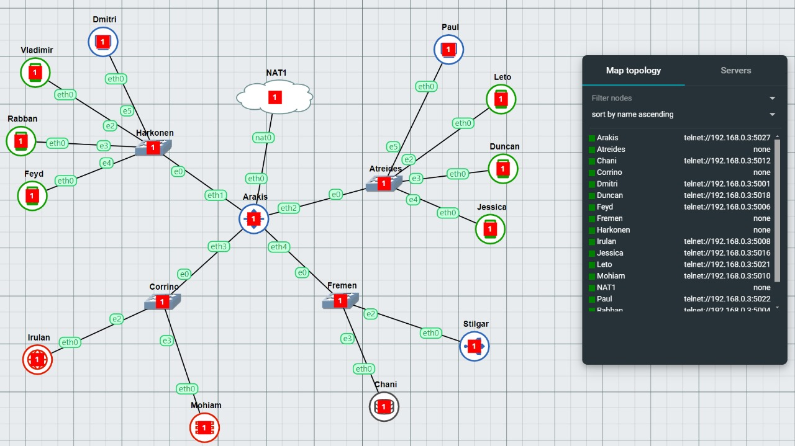

# Laporan Resmi Praktikum Jarkom Modul 3
## Kelompok IT32
**Anggota Kelompok:**

| Nama                               | NRP        |
| ---------------------------------- | ---------- |
| Atha Rahma Arianti                 | 5027221030 |
| Nur Azka Rahadiansyah              | 5027221064 |





| Node    | Kategori            | Konfigurasi IP |
| ------- | ------------------- | -------------- |
| Arakis  | Router (DHCP Relay) | Dynamic        |
| Mohiam  | DHCP Server         | Static         |
| Irulan  | DNS Server          | Static         |
| Chani   | Database Server     | Static         |
| Stilgar | Load Balancer       | Static         |
| Leto    | Laravel Worker      | Static         |
| Duncan  | Laravel Worker      | Static         |
| Jessica | Laravel Worker      | Static         |
| Vladimir| PHP Worker          | Static         |
| Rabban  | PHP Worker          | Static         |
| Feyd    | PHP Worker          | Static         |
| Dmitri  | Client              | Dynamic        |
| Paul    | Client              | Dynamic        |

## NETWORK CONFIG

- Arakis Router (DHCP Relay) Dynamic

```
  auto eth0
  iface eth0 inet dhcp
  up iptables -t nat -A POSTROUTING -o eth0 -j MASQUERADE -s 10.63.0.0/16
  
  auto eth1
  iface eth1 inet static
  	address 10.63.1.0
  	netmask 255.255.255.0
  
  auto eth2
  iface eth2 inet static
  	address 10.63.2.0
  	netmask 255.255.255.0
  
  auto eth3
  iface eth3 inet static
  	address 10.63.3.0
  	netmask 255.255.255.0
  
  auto eth4
  iface eth4 inet static
  	address 10.63.4.0
  	netmask 255.255.255.0
```

- Harkomen:

  Dmitri (Client - Dynamic)

  ```
  auto eth0
  iface eth0 inet dhcp
  ```
  
  Vladimir (PHP Worker)

```
  auto eth0
  iface eth0 inet static
  	address 10.63.1.2
  	netmask 255.255.255.0
  	gateway 10.63.1.0
```
  
  Rabban (PHP Worker)

  ```
  auto eth0
  iface eth0 inet static
  	address 10.63.1.3
  	netmask 255.255.255.0
  	gateway 10.63.1.0
```

  Feyd (PHP Worker)

  ```
  auto eth0
  iface eth0 inet static
  	address 10.63.1.4
  	netmask 255.255.255.0
  	gateway 10.63.1.0
```

- Corrino:
  Irulan (DNS Server)
  
```
  auto eth0
  iface eth0 inet static
  	address 10.63.3.2
  	netmask 255.255.255.0
  	gateway 10.63.3.0
```
  
  Mohiam (DHCP Server)

  ```
  auto eth0
  iface eth0 inet static
  	address 10.63.3.3
  	netmask 255.255.255.0
  	gateway 10.63.3.0
  ```


- Atreides:
  Paul (Client - Dynamic)
```
  auto eth0
  iface eth0 inet dhcp
```
  
  Leto (Laravel Worker)

  ```
  auto eth0
  iface eth0 inet static
  	address 10.63.2.2
  	netmask 255.255.255.0
  	gateway 10.63.2.0
```
  
  Duncan (Laravel Worker)

  ```
  auto eth0
  iface eth0 inet static
  	address 10.63.2.3
  	netmask 255.255.255.0
  	gateway 10.63.2.0
```
  
  Jessica (Laravel Worker)

  ```
  auto eth0
  iface eth0 inet static
  	address 10.63.2.4
  	netmask 255.255.255.0
  	gateway 10.63.2.0
```

- Fremen:
  Stilgar (Load Balancer)
```
  auto eth0
  iface eth0 inet static
  	address 10.63.4.2
  	netmask 255.255.255.0
  	gateway 10.63.4.0
```

  Chani (Database Server)
  
  ```
  auto eth0
  iface eth0 inet static
  	address 10.63.4.3
  	netmask 255.255.255.0
  	gateway 10.63.4.0
```


## SETUP

- Irulan (DNS Server):

  ```
  echo 'nameserver 192.168.122.1' > /etc/resolv.conf
  apt-get update
  apt-get install bind9 -y  

  echo ‘
  options {
      directory "/var/cache/bind";
  
      forwarders {
          192.168.122.1;
      };
  
      // dnssec-validation auto;
      allow-query { any; };
      auth-nxdomain no;    # conform to RFC1035
      listen-on-v6 { any; };
  };
  ‘ > /etc/bind/named.conf.options
  
  service bind9 restart

  ```

- Mohiam DHCP Server:

  ```
  echo 'nameserver 10.63.3.2' > /etc/resolv.conf  
  apt-get update
  apt install isc-dhcp-server -y
  ```

- Arakis DHCP Relay:

  ```
  apt-get update
  apt install isc-dhcp-relay -y
  ```

  isi IP mohiam: 10.63.3.3

- Chani Database server:

  ```
  echo 'nameserver 10.63.3.2' > /etc/resolv.conf
  apt-get update
  apt-get install mariadb-server -y
  
  service mysql start
  ```
  
  Lalu jangan lupa untuk mengganti [bind-address] pada file /etc/mysql/mariadb.conf.d/50-server.cnf menjadi 0.0.0.0
  
  ```
  service mysql restart
  ```

- Stilgar Load Balancer:

  ```
  echo 'nameserver 10.63.3.2' > /etc/resolv.conf
  apt-get update
  apt-get install apache2-utils -y
  apt-get install nginx -y
  apt-get install lynx -y
  
  service nginx start
  ```

- Vladimir, Rabban, Feyd PHP worker:

  ```
  echo 'nameserver 10.63.3.2' > /etc/resolv.conf
  apt-get update
  apt-get install nginx -y
  apt-get install wget -y
  apt-get install unzip -y
  apt-get install lynx -y
  apt-get install htop -y
  apt-get install apache2-utils -y
  apt-get install php7.3-fpm php7.3-common php7.3-mysql php7.3-gmp php7.3-curl php7.3-intl php7.3-mbstring php7.3-xmlrpc php7.3-gd php7.3-xml php7.3-cli php7.3-zip -y
  
  service nginx start
  service php7.3-fpm start
  ```

- Leto, Duncan, Jessica laravel worker:

  ```
  echo 'nameserver 10.63.3.2' > /etc/resolv.conf
  apt-get update
  apt-get install lynx -y
  apt-get install mariadb-client -y
  # Test connection from worker to database
  # mariadb --host=10.63.2.1 --port=3306   --user=kelompokit32 --password=passwordit32 dbkelompokit32 -e "SHOW DATABASES;"
  apt-get install -y lsb-release ca-certificates apt-transport-https software-properties-common gnupg2
  curl -sSLo /usr/share/keyrings/deb.sury.org-php.gpg https://packages.sury.org/php/apt.gpg
  sh -c 'echo "deb [signed-by=/usr/share/keyrings/deb.sury.org-php.gpg] https://packages.sury.org/php/ $(lsb_release -sc) main" > /etc/apt/sources.list.d/php.list'
  apt-get update
  apt-get install php8.0-mbstring php8.0-xml php8.0-cli   php8.0-common php8.0-intl php8.0-opcache php8.0-readline php8.0-mysql php8.0-fpm php8.0-curl unzip wget -y
  apt-get install nginx -y
  
  service nginx start
  service php8.0-fpm start
  ```

- Dmitri, Paul client:

  ```
  apt update
  apt install lynx -y
  apt install htop -y
  apt install apache2-utils -y
  apt-get install jq -y
  ```


